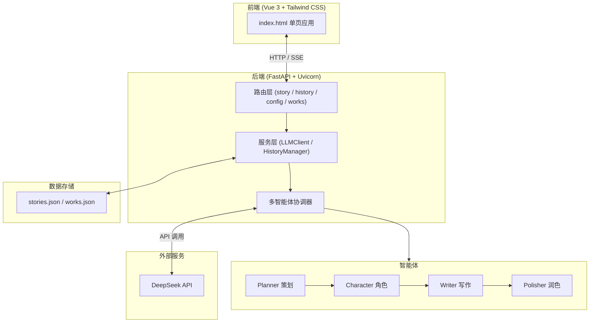

# TaleForge - 智能故事生成器

## 项目简介

TaleForge 是一个基于 AI 多智能体协作架构的智能故事生成器。用户输入故事主题和参数，系统通过策划（Planner）、角色（Character）、写作（Writer）、润色（Polisher）四个智能体的协同工作，生成高质量的叙事内容。

---

## 核心功能

| 功能 | 说明 |
|------|------|
| **故事生成** | 输入主题、体裁、风格、字数等参数，AI 自动生成完整故事 |
| **多体裁支持** | 短篇小说、中篇小说、科幻、奇幻、悬疑推理、童话、诗歌等 |
| **角色设定** | 自定义添加角色，支持从模板快速选择，含名称/年龄/身份/外貌/性格/背景/动机 |
| **世界观设定** | 详细描述架空世界观，生成内容自动融入世界设定 |
| **剧情设置** | 背景、叙事视角、冲突类型、情感基调、故事梗概 |
| **伏笔管理** | 显式定义伏笔，在生成中自动埋设与回收 |
| **续写功能** | 基于前作继续生成后续章节，保持情节连贯 |
| **创作模板** | 8 种预设模板（英雄之旅、悬疑推理、都市爱情等），一键应用 |
| **收藏标记** | 收藏喜欢的故事，快速筛选查看 |
| **故事编辑** | 编辑模式下支持源码/预览实时切换，修改后即时渲染 |
| **导出下载** | 导出为 Markdown / 纯文本格式 |
| **历史记录** | 搜索、分页、按体裁筛选、收藏筛选 |
| **实时流式输出** | SSE 技术，生成过程实时显示在页面 |
| **Markdown 渲染** | 故事内容支持标题、粗体、代码块等格式，即时渲染 |
| **一键启动** | `start.py` 自动创建虚拟环境、安装依赖、引导配置 API Key |

---

## 技术架构



### 智能体协作流程


每个智能体通过 SSE 事件流实时反馈状态和阶段性结果。

---

## 启动方式

```bash
# 方式1：Python 启动器（推荐）
python start.py

# 方式2：双击 start.bat
```

启动器自动完成：虚拟环境创建 → 依赖安装 → API Key 配置引导 → 端口清理 → 启动服务器。  
换电脑后只需拷贝项目文件夹，双击 `start.bat` 即可运行。

访问：http://127.0.0.1:8080

---

## 运行测试

```bash
# 后端 API 测试（20 项）
python -m pytest backend/tests/test_api.py -v

# 前端 E2E 测试（15 项 - 需 Playwright）
python -m pytest backend/tests/test_frontend.py -v

# 全部测试
python -m pytest backend/tests/ -v
```

---

## 环境需求

- Python 3.9+
- 依赖：`pip install -r requirements.txt`
- DeepSeek API Key（在页面设置中配置或写入 .env 文件）

  

  可在设置中修改apikey的配置

